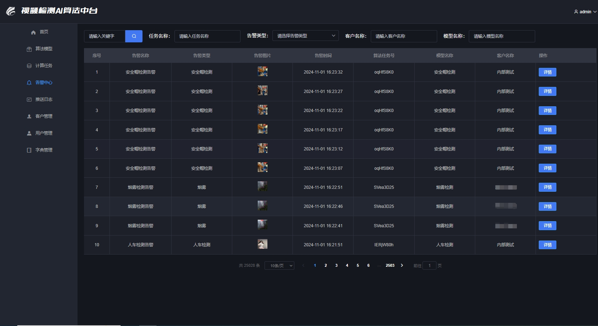

# java_pytorch_onnx_tensorrt_yolov8_vue 
  视频算法中台系统

#### 介绍

    1.基于SpringBoot+Docker+Cuda+Cudnn+Pythorch+Onnx+Tensorrt+Yolov8+ffmpeg+zlmediakit 的AI算法中台系统，本系统主要实现JAVA调用Python脚本的方式，实现在GPU(Nvidia Tesla T4)上进行yolov8的加速推理运算。

    2.项目可实现人、车、火灾烟雾、河道漂浮物、道路裂痕等视频的实时识别，并将识别结果通过ffmpeg推流到zlmediakit流媒体服务器，使得在web页面上可以同时查看原始视频和实时计算视频。

    3.项目每隔1分钟将推理结果信息和对应的图片推送到文件服务器minio和消息队列rocketmq,便于开发者获取到推理结果进行业务开发。
    
    4.项目同时支持基于ONNX的推理运算和基于Tensorrt的加速推理运算2种方式,只需在调用时传递不同参数即可。

    5.项目同时支持Linux和Windows环境，代码自动判断运行的环境并执行对应的.bat或.sh脚本文件以启动AI模型推理。

    6.项目包含前端完整代码和后端完整代码，开箱即用，为JAVA开发者训练、部署、使用AI模型提供了参考。

    7.项目的核心是yolov8神经网络模型的推理运算，推理运算涉及操作cpu内存、gpu内存、gpu并行计算等环节，这些环节可通过python或c++来实现，作者对2种方式均进行了实现，目前分享给大家的是基于python库进行推理的，c++的推理代码作者并未提交(因为涉及cuda编程会增加小伙伴们特别是java开发者的难度)，如果是商业应用或者追求极限性能的小伙伴可联系我免费获取，所以就不放于此处了，以免增加项目复杂性。当然，目前这套基于python库推理的技术栈已经拥有非常高的性能，视频无延迟无卡顿，推理几乎是实时计算的，能够满足商业应用，所以没有特殊需求，并不需要使用c++进行推理。

  
    

#### 软件架构

1.系统架构
    本AI算法中台系统结合了SpringBoot开发Web项目的优势、Python训练调试AI模型的优势、Shell脚本便于调用Linux服务器资源的优势，将不同语言综合一起协调工作，并将项目运行在Docker容器中以便于运维和管理，让JAVA开发者能够方便训练、部署、使用AI模型。

2.技术栈

开发环境：IDEA、JDK1.8、Maven、Gitlab、Pycharm、Anaconda3

软件架构：Nginx + SpringBoot + Vue + Shell + Python

前端框架：Vue + Nodejs

Web框架：SpringBoot

Orm框架：MyBatis3

数据库：Mysql、Redis、MongoDB

消息队列：RocketMq

文件服务: Minio

代码生成: FreeMarker自动生成后端Java代码和前端Vue代码

CPU设备: Intel(R) Xeon(R) Gold 5218 CPU @ 2.30GHz

GPU设备: Nvidia Tesla T4 16G

AI模型：Yolov8n/Yolov8m

训练环境：Pytorch2.3.0 + Onnxruntime-gpu1.16.1 + Ultralytics8.2.48

推理环境: Cuda11.8 + Cudnn8.6.0 + Tensorrt8.5.1.7 + Onnxruntime-gpu1.16.1

推理加速: Tensorrt8.5.1.7

视频操作：Opencv4.7.0

视频推流: FFmpeg4.2.7

流媒体服务：Zlmediakit

部署环境：Docker + Ubuntu20.04

#### 目录说明

data/algorithm_model : 算法模型库，提供了作者训练并部署的5个常用算法模型,包括.pt .onnx .engine 三种格式

data/doc : 算法中台接口文档

data/front_code : 项目前端Vue代码

data/linux : linux下的onnx和tensorrt推理运行代码

data/windows : windows下的onnx和tensorrt推理运行代码

data/sql : 项目数据库

src : 项目后端springboot代码

#### 安装教程

1.安装Zlmediakit流媒体服务器，安装方法如下:

    (1).拉取docker镜像
    docker pull zlmediakit/zlmediakit:master

    (2).创建目录以存放zlmediakit数据
    mkdir -p /home/docker/zlmediakit && chmod 777 /home/docker/zlmediakit

    (3).运行镜像
        --1.先运行镜像得到配置文件
        docker run --name zlmediakit -d zlmediakit/zlmediakit:master

        --2.复制 zlmediakit 容器文件到指定目录
        docker cp -a zlmediakit:/opt/media /home/docker/zlmediakit

        --3.删除 zlmediakit 容器
        docker rm -f zlmediakit

        --4.重新按自定义方式运行
        docker run --name zlmediakit --restart=always --env MODE=standalone -e TZ="Asia/Shanghai" \
            -v /home/docker/zlmediakit/media/bin:/opt/media/bin \
            -v /home/docker/zlmediakit/media/conf:/opt/media/conf \
            -p 11935:1935 -p 11080:80 -p 11554:554 \
            -p 11000:10000 -p 11000:10000/udp -p 18000:8000/udp \
            -p 50000-50300:50000-50300/udp \
            -d zlmediakit/zlmediakit:master

2.安装mysql、mongodb、redis、rocketmq、minio

3.导入项目的Mysql数据库 data/sql/algorithm_center.sql

4.安装推理环境并运行后端项目

  (1).在Windows下安装推理环境并运行(根据自己计算机的硬件配置情况选择如下3种安装方式中的1种)

      **1**.安装推理环境

        1).计算机没有GPU显卡---使用onnxruntime的cpu版本进行推理
        --1.电脑主机需要安装如下软件
            ①.Anaconda3(安装方法百度: Windows安装anaconda3 或参考 https://blog.csdn.net/zwLoneranger/article/details/138743242)
            ②.opencv4.7.0 (安装方法百度: Windows安装opencv)
            ③.FFmpeg4.2.7 (安装方法百度: Windows安装FFmpeg)

        --2.由于推理代码是使用python语言运行,所以需要在Python环境(如Python3.9/Anaconda3/Miniconda)中安装如下依赖库:
            ①.opencv-python4.9.0.80 (安装方法: pip install opencv-python==4.9.0.80 -i https://pypi.tuna.tsinghua.edu.cn/simple/)
            ②.torch2.0.1 + torchvision0.15.2 + torchaudio2.0.2 (安装方法: pip install torch==2.0.1 torchvision==0.15.2 torchaudio==2.0.2 --index-url https://download.pytorch.org/whl/cu118)
            ③.yolov8 ultralytics (安装方法: pip install ultralytics==8.2.48 -i https://pypi.tuna.tsinghua.edu.cn/simple/)
            ④.Onnxruntime-cpu1.16.1 (运行.onnx模型文件需要该依赖，此处安装cpu版本。安装方法: pip install onnxruntime-cpu==1.16.1 -i https://pypi.tuna.tsinghua.edu.cn/simple/)
        

        2).计算机有GPU显卡---使用onnxruntime的gpu版本进行推理
        --1.电脑主机需要安装如下软件
            ①.Anaconda3(安装方法百度: Windows安装anaconda3 或参考 https://blog.csdn.net/zwLoneranger/article/details/138743242)
            ②.opencv4.7.0 (安装方法百度: Windows安装opencv)
            ③.FFmpeg4.2.7 (安装方法百度: Windows安装FFmpeg)
            ④.Cuda11.8 (安装方法百度: Windows安装Cuda)
            ⑤.Cudnn8.6.0 (安装方法百度: Windows安装Cudnn)

        --2.由于推理代码是使用python语言运行,所以需要在Python环境(如Python3.9/Anaconda3/Miniconda)中安装如下依赖库:
            ①.opencv-python4.9.0.80 (安装方法: pip install opencv-python==4.9.0.80 -i https://pypi.tuna.tsinghua.edu.cn/simple/)
            ②.torch2.0.1 + torchvision0.15.2 + torchaudio2.0.2 (安装方法: pip install torch==2.0.1 torchvision==0.15.2 torchaudio==2.0.2 --index-url https://download.pytorch.org/whl/cu118)
            ③.yolov8 ultralytics (安装方法: pip install ultralytics==8.2.48 -i https://pypi.tuna.tsinghua.edu.cn/simple/)
            ④.Onnxruntime-gpu1.16.1 (运行.onnx模型文件需要该依赖，此处安装gpu版本。安装方法: pip install onnxruntime-gpu==1.16.1 -i https://pypi.tuna.tsinghua.edu.cn/simple/)
        

        3).计算机有GPU显卡,并且是Nvidia的显卡---使用Nvidia的Tensorrt进行推理加速(速度大于onnx推理,是目前推理速度最快的方式)
        --1.电脑主机需要安装如下软件
            ①.Anaconda3(安装方法百度: Windows安装anaconda3 或参考 https://blog.csdn.net/zwLoneranger/article/details/138743242)
            ②.opencv4.7.0 (安装方法百度: Windows安装opencv)
            ③.FFmpeg4.2.7 (安装方法百度: Windows安装FFmpeg)
            ④.Cuda11.8 (安装方法百度: Windows安装Cuda)
            ⑤.Cudnn8.6.0 (安装方法百度: Windows安装Cudnn)
            ⑥.Tensorrt8.5.1.7 (运行.engine模型文件需要该依赖。安装方法百度: Windows安装Tensorrt)

        --2.由于推理代码是使用python语言运行,所以需要在Python环境(如Python3.9/Anaconda3/Miniconda)中安装如下依赖库:
            ①.opencv-python4.9.0.80 (安装方法: pip install opencv-python==4.9.0.80 -i https://pypi.tuna.tsinghua.edu.cn/simple/)
            ②.torch2.0.1 + torchvision0.15.2 + torchaudio2.0.2 (安装方法: pip install torch==2.0.1 torchvision==0.15.2 torchaudio==2.0.2 --index-url https://download.pytorch.org/whl/cu118)
            ③.yolov8 ultralytics (安装方法: pip install ultralytics==8.2.48 -i https://pypi.tuna.tsinghua.edu.cn/simple/)
            ④.Onnxruntime-gpu1.16.1 (运行.onnx模型文件需要该依赖，此处安装gpu版本。安装方法: pip install onnxruntime-gpu==1.16.1 -i https://pypi.tuna.tsinghua.edu.cn/simple/)

      **2**.本地IDEA中启动后端项目

        --1.修改mysql、mongoDB、redis、rocketmq、minio的连接地址
      
        --2.运行 AlgorithmCenterApplication.main(String[] args)以启动项目

    

  (2).在Linux的Docker容器中安装推理环境并运行

      1).在服务器新建3个目录比如 /home/docker/ai/py_java/algcenter  /home/docker/ai/py_java/nvidia  /home/docker/ai/py_java/opencv

      2).拷贝docker运行的所需文件到服务器
         --1.将data/algcenter/下的所有内容拷贝到/home/docker/ai/py_java/algcenter/目录，algcenter下的内容为项目jar包(jar需要执行 mvn clean intsall打包放入algcenter)和项目的配置文件

         --2.下载英伟达(NVIDIA)相关的文件并保存到/home/docker/ai/py_java/nvidia/ 目录
             ①.下载cuda_11.8,下载命令 wget https://developer.download.nvidia.com/compute/cuda/11.8.0/local_installers/cuda_11.8.0_520.61.05_linux.run

             ②.下载cuDNN8.6.0.163,下载地址 https://developer.nvidia.com/rdp/cudnn-archive#a-collapse897-118

             ③.下载tensorRT 8.5.1.17,下载地址 https://developer.nvidia.com/tensorrt
 
         --3.下载opencv4.7.0并保存到/home/docker/ai/py_java/opencv/目录,下载地址 https://opencv.org/releases/

         --4.构建docker镜像
             ①.将data/docker/Dockerfile 拷贝到服务器 /home/docker/ai/py_java/
             
             ②.进入到/home/docker/ai/py_java/目录，执行 docker build -t py_java_ai:1.0 . 命令以构建镜像

             ③.该镜像包含ubuntu20.04、jdk11、python3.8、pip、opencv、cuda11.8、cudnn8.6.0、TensorRT8.5.1.7、onnxruntime-gpu==1.16.1、pytorch2.3.0、ultralytics8.2.48

       3).镜像构建完成后，执行docker run 命令以便运行algcenter
          docker run --name=algcenter --restart=always --privileged=true \
                     --gpus all \
                     -p 8088:8088 \
                     -v /home/docker/ai/py_java/algcenter/:/data/app \ 
                     -v /home/docker/ai/py_java/algcenter/config:/config \
                     -v /etc/localtime:/etc/localtime \
                     -d py_java_ai:1.0 /data/app/run.sh

5.运行前端项目 

  (1).本地VSCODE中运行：

      1).安装依赖 npm install
      
      2).修改服务器的访问地址

      3).启动项目 npm run dev
     
      4).访问地址 http://ip:8080/login  用户名/密码: admin / 123456

  (2).服务器Nginx中运行:

      1).nginx的安装

         --1.在服务器新建目录 /home/docker/ai/nginx/

         --2.将data/nginx/下的所有文件拷贝到服务器 /home/docker/ai/nginx/目录下
         
         --3.执行docker run 命令以便运行nginx
            docker run --name=nginx --restart=always  --privileged=true \
                    -p 8080:80 -p 1935:1935 \
                    -v /home/docker/ai/nginx/data:/usr/share/nginx/html/ \
                    -v /home/docker/ai/nginx/config/nginx.conf:/etc/nginx/nginx.conf \
                    -v /home/docker/ai/nginx/config/conf.d/default.conf:/etc/nginx/conf.d/default.conf\
                    -v /home/docker/ai/nginx/logs:/var/log/nginx/ \
                    -v /home/docker/ai/nginx/ssl:/ssl/ \
                    -d tiangolo/nginx:latest 

      2).打包项目 npm build
      
      3).将打包后新生成的dist文件夹拷贝到Nginx的/home/docker/ai/nginx/data/目录

      4).访问地址 http://ip:8080/login  用户名/密码: admin / 123456

使用说明

1.算法中台的使用

  (1).前后端代码运行起来后，打开页面 http://ip:8080/login  用户名/密码: admin / 123456

  (2).点击"算法模型"即可上传修改删除训练好的AI模型

  (3).点击"计算任务"即可查看需要计算的任务，点击启用即可开始进行AI模型的推理运算

  (4).点击"告警中心"即可查看模型的告警记录,比如识别到河道有垃圾漂浮物即产生一条告警信息

  (5).点击"推送日志"即可查看本平台向其他平台推送的HTTP告警日志记录

  (6).点击"客户管理"即可查看需要给哪些客户平台推送告警信息

  (7).打开文件data/doc_sql/算法中台接口文档(v2.0).docx 即可通过接口实现与算法中台的对接

2.模型的训练
 
 以训练YOLOv8目标检测模型为例:

  (1).Yolov8 预训练模型下载 https://github.com/ultralytics/ultralytics

  (2).自己准备数据或在kaggle、 CV Datasets on the web、 阿里天池数据集等深度学习数据集下载网站下载数据

  (3).将数据集分为训练集、验证集、测试集，使用Pytorch加载Yolov8预训练模型并训练自己的数据

  (4).查看训练结果，主要关注精确度Precision、召回率Recall、P-R曲线、F1 Score、mAP50、mAP50-95等重要参数

  (5).根据模型训练结果判断是否需要进行再次的调优训练，例如修改Epoch、调整训练集、测试集的比例等等

  (6).训练完成后得到当前最佳的模型best.pt

  (7).使用Python脚本调用best.pt运行测试集数据进行模型的验证

3.模型的部署

  (1).将训练好的best.pt拷贝到容器内部的 /data/app/yolo/tensorrt_infer/YOLOv8-TensorRT-main目录下

  (2).进入到/data/app/yolo/tensorrt_infer/YOLOv8-TensorRT-main目录,通过如下命令将 best.pt 转换为 best.onnx模型格式
      python3 export-det.py --weights best.pt --iou-thres 0.65 --conf-thres 0.25 --topk 100 --opset 11 --sim --input-shape 1 3 640 640
  
  (3).接着执行如下命令将best.onnx转为tensorrt的引擎文件格式best.engine，以便实现在nvidia gpu上进行推理加速
      /gsis_ai/nvidia/TensorRT-8.5.1.7/bin/trtexec --onnx=best.onnx --saveEngine=best.engine --fp16

  (4).在算法中台管理界面点击"算法模型-添加"，填写模型基本信息，视频地址可以是rtsp/rtmp/flv/hls/http/ws等任意格式的视频地址或离线视频文件.mp4，注意模型键(modelKey)为刚才生成的引擎文件的文件名best,脚本键(shellKey)为yolov8

  (5).填写好模型信息后，点击文件上传，将转换生成好的best.engine上传到minio中，后期运行该模型时系统会自动下载该模型到对应的工作目录(比如 /data/app/yolo/tensorrt_infer/)

  (6).在计算任务中点击 "新增"选择模型，添加对应的视频地址，然后保存

  (7).在任务列表点击"启用"即可加载模型并进行推理

  (8).启用成功后点击最右边视频图标，即可查看原始视频画面和实时推理画面

效果展示

参与贡献

1.黑白条纹

2.QinJ5

3.Zoe

在此特别谢鸣骄姐与Zoe的鼎力支持，感谢您们的一路相伴!!

相关开源

常康:Java-Onnx-Yolo

https://toscode.mulanos.cn/agricultureiot/yolo-onnx-java

xgc:JavaVision

https://gitee.com/giteeClass/java-vision

参与讨论

1.欢迎各位朋友参与讨论

  github地址： https://github.com/xiaoyeshenger/java_pytorch_onnx_tensorrt_yolov8_vue

  gitee地址： https://gitee.com/qj-zye/java_pytorch_onnx_tensorrt_yolov8_vue

2.如需详细了解或帮助，可加我微信 ZZ449557260

